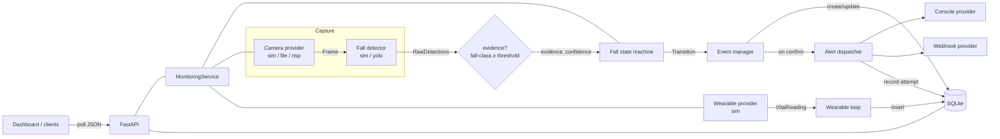
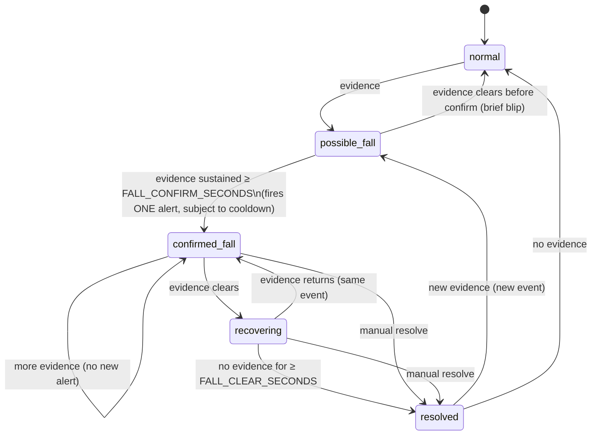

# VytalLink — Architecture

Phase 1 architecture. Simulation-first, with clean adapters for real hardware.

## 1. Components

| Component | Module | Responsibility |
| --- | --- | --- |
| Config | `vytallink.config` | Env/`.env` settings, validation, secret sanitization |
| Clock | `vytallink.common.clock` | Injectable time source (`SystemClock`, `ManualClock`) |
| Logging | `vytallink.common.logging_setup` | Console + rotating file logs |
| Database | `vytallink.database` | SQLite schema, migrations, thread-safe access, repositories |
| State machine | `vytallink.events.state_machine` | Pure fall-event logic (timing, cooldown) |
| Event manager | `vytallink.events.manager` | State machine ↔ persistence ↔ alert dispatch |
| Camera | `vytallink.vision` (`simulated`/`file_source`/`rtsp`) | Frame source with reconnection |
| Detector | `vytallink.vision` (`detector_simulated`/`detector_yolo`) | Raw detections per frame |
| Wearable | `vytallink.wearable` | Vital readings (simulated in Phase 1) |
| Alerts | `vytallink.alerts` | Console + webhook providers, dispatcher |
| Monitoring | `vytallink.monitoring.service` | Orchestrates providers + loops, aggregates health |
| API | `vytallink.api` | FastAPI endpoints, validation, error handling |
| Dashboard | `vytallink.dashboard` | Polling HTML/CSS/JS UI |

## 2. Data flow

In **simulation** mode the detection loop is health-only and the state machine
is driven deterministically by the simulation controls (ManualClock). In
**live** mode (`file`/`rtsp`) a real-time loop feeds the state machine on a
SystemClock. The wearable loop runs in both modes.

## 3. Event state machine

Key guarantees (all unit-tested, sleep-free via `ManualClock`):
- A **possible** blip that clears before the confirm window creates **no event**.
- Exactly **one alert per confirmed event**; repeated evidence does not re-alert.
- `ALERT_COOLDOWN_SECONDS` suppresses a *new* event's alert if it confirms too
  soon after the previous **successfully delivered** alert; after cooldown, a
  new event alerts again. The cooldown is armed by the EventManager only once a
  provider actually delivers (`commit_alert`); a *failed* delivery does not arm
  it, so a missed alert can never suppress the alert for the next real fall.
- Events are persisted to the DB at **confirmation** (not while merely possible).

## 4. Database overview

SQLite, schema versioned via `PRAGMA user_version`, WAL journaling, single
connection guarded by an `RLock`. Tables:

- **events** — uid, type, state, start/confirmed/end/resolved times, highest
  confidence, detection count, source device, snapshot/clip paths, human label,
  resolution note, created/updated. Indexed on state, start_time, created_at, label.
- **vitals** — timestamp, device, heart_rate, motion, connection_quality,
  battery, simulated flag, metadata. Indexed on device + timestamp.
- **alerts** — event uid, provider, attempt_time, success, failure_message,
  response_metadata. Indexed on event, provider, attempt_time.
- **devices** — id, type, display_name, connection_status, last_seen,
  last_error, metadata.

Restart preserves the database; `scripts/reset_demo_data.sh` clears the dev DB.

## 5. Provider interface design

Each subsystem is an interface with a simulated implementation (a *real* working
provider explicitly labeled "simulation") plus hardware adapters:

- **CameraProvider** (`_open_source`/`_read_frame`/`_close_source`) — base class
  adds frame counting, effective-fps, stale detection, and bounded-backoff
  reconnection. `read()` never raises; returns `None` when no frame.
- **FallDetector** (`load`/`infer`) — `detections_to_evidence` maps detections to
  `(evidence, confidence)` using configured fall classes + threshold.
- **WearableProvider** (`connect`/`read`/`disconnect`) — connection state + health.
- **AlertProvider** (`send` → `AlertResult`) — never raises; the **AlertDispatcher**
  records every attempt and isolates provider exceptions.

Factories (`build_camera`, `build_detector`, `build_wearable`, `build_dispatcher`)
select implementations from settings.

## 6. Simulation vs hardware mode

| Aspect | Simulation (Phase 1 default) | Hardware (future) |
| --- | --- | --- |
| Camera | `SimulatedCamera` (no pixels) | `RTSPCamera` / `VideoFileCamera` (cv2) |
| Detector | `SimulatedFallDetector` (scenarios) | `YoloFallDetector` (Ultralytics) |
| Event clock | `ManualClock` (driven by controls) | `SystemClock` (real-time loop) |
| Wearable | `SimulatedWearable` (deterministic) | provider behind same interface |
| Alerts | console (+ optional webhook) | + SMS/email/push |
| GPU | not required | CUDA PyTorch / TensorRT |

## 7. Key technical decisions

1. **Clock injection** everywhere timing matters → deterministic, sleep-free
   tests, and instant-but-real simulation driving.
2. **FastAPI + uvicorn** for built-in validation, async background loops, and
   JSON-native responses (see `docs/environment_decision.md`).
3. **`--system-site-packages` venv** to keep Jetson `cv2`/`torch`/`tensorrt`.
4. **Persist at confirmation** so the events table stays meaningful; live
   current-state lives in memory and is exposed via `/health`.
5. **Simulated providers are real providers** (never mocks in the runtime path);
   only the clock is advanced by hand in simulation.
6. **Secrets never logged**; RTSP URLs redacted; event media off by default; no
   live video feed exposed.
